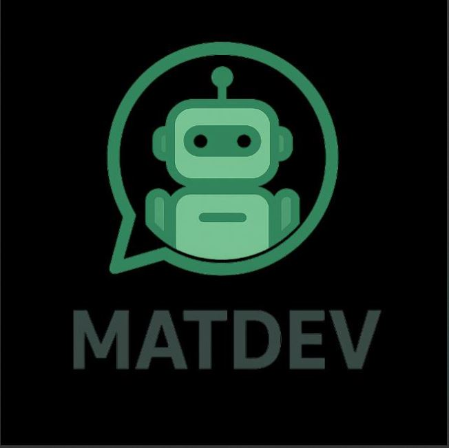

<p align="center">
  
</p>

[](https://nodejs.org/)
[](https://github.com/WhiskeySockets/Baileys)
[]()

**⚡ High-Performance Application with Auto-Update System**

*Host on any platform with zero configuration*

</div>

## 🚀 Quick Deploy

### Auto-Manager
Use our auto-manager system to automatically deploy and update your application:

<div align="center">

**📋 Copy Auto-Manager Code**

<details>
<summary><strong>📋 Click to copy index.js content</strong></summary>

```javascript
const { spawn, spawnSync } = require('child_process');
const { existsSync } = require('fs');

console.log('🎯 MATDEV Auto-Manager');
console.log('📍 Working in:', __dirname);

// Your GitHub repository
const GITHUB_REPO = 'https://github.com/marhthing/matdev.git';

// Check if this is an initial setup, restart, or forced update
const isInitialSetup = !existsSync('bot.js') || !existsSync('config.js') || !existsSync('package.json');
const isForcedUpdate = existsSync('.update_flag.json');

if (isInitialSetup || isForcedUpdate) {
    if (isForcedUpdate) {
        console.log('🔄 Forced update detected - recloning from GitHub...');
    } else {
        console.log('🔧 Initial setup detected - cloning from GitHub...');
    }
    cloneAndSetup();
} else {
    console.log('🚀 Starting MATDEV...');
    startBot();
}

function cloneAndSetup() {
    console.log('📥 Cloning application from GitHub...');
    console.log('🔗 Repository:', GITHUB_REPO);

    // Clean workspace (preserve important files)
    console.log('🧹 Cleaning workspace (preserving session folder, .env, and config.js)...');
    spawnSync('bash', ['-c', 'find . -maxdepth 1 ! -name "." ! -name "index.js" ! -name "node_modules" ! -name "session" ! -name ".env" ! -name "config.js" -exec rm -rf {} +'], { stdio: 'inherit' });

    // Clone repository
    const cloneResult = spawnSync('git', ['clone', GITHUB_REPO, 'temp_clone'], {
        stdio: 'inherit'
    });

    if (cloneResult.error || cloneResult.status !== 0) {
        console.error('❌ Failed to clone repository!');
        console.error('Error:', cloneResult.error?.message || `Exit code: ${cloneResult.status}`);
        process.exit(1);
    }

    // Backup and move files
    console.log('📁 Moving application files (preserving existing .env and config.js)...');
    spawnSync('bash', ['-c', 'cp .env .env.backup 2>/dev/null || true; cp config.js config.js.backup 2>/dev/null || true'], { stdio: 'inherit' });
    
    const moveResult = spawnSync('bash', ['-c', 'cp -r temp_clone/. . && rm -rf temp_clone'], {
        stdio: 'inherit'
    });
    
    spawnSync('bash', ['-c', 'mv .env.backup .env 2>/dev/null || true; mv config.js.backup config.js 2>/dev/null || true'], { stdio: 'inherit' });

    if (moveResult.error || moveResult.status !== 0) {
        console.error('❌ Failed to move application files!');
        console.error('Error:', moveResult.error?.message || `Exit code: moveResult.status}`);
        process.exit(1);
    }

    console.log('✅ Application files moved successfully!');

    // Find entry point
    let entryPoint = findEntryPoint();
    if (!entryPoint) {
        console.error('❌ No application entry point found!');
        process.exit(1);
    }
    console.log(`✅ Found application entry point: ${entryPoint}`);

    // Install dependencies
    if (existsSync('package.json')) {
        console.log('📦 Installing dependencies...');
        const installResult = spawnSync('npm', ['install'], {
            stdio: 'inherit'
        });

        if (installResult.error || installResult.status !== 0) {
            console.error('❌ Failed to install dependencies');
            process.exit(1);
        }
        console.log('✅ Dependencies installed!');
    }

    // Start the application
    startBot(entryPoint);
}

function findEntryPoint() {
    const possibleEntryPoints = ['bot.js', 'app.js', 'main.js', 'src/index.js'];
    
    for (const file of possibleEntryPoints) {
        if (existsSync(file)) {
            return file;
        }
    }

    // Check package.json for main field
    if (existsSync('package.json')) {
        try {
            const packageJson = JSON.parse(require('fs').readFileSync('package.json', 'utf8'));
            if (packageJson.main && existsSync(packageJson.main)) {
                return packageJson.main;
            }
        } catch (err) {
            console.log('⚠️ Could not read package.json main field');
        }
    }

    return null;
}

function startBot(entryPoint = 'bot.js') {
    console.log(`🚀 Starting application: ${entryPoint}`);

    const botProcess = spawn('node', [entryPoint], {
        stdio: 'inherit'
    });

    let restartCount = 0;
    const maxRestarts = 5;

    botProcess.on('exit', (code, signal) => {
        console.log(`🔄 Application exited with code ${code}, signal ${signal}`);
        
        if (signal !== 'SIGTERM' && signal !== 'SIGINT') {
            if (code === 0) {
                console.log(`🔄 Restarting application as requested...`);
                setTimeout(() => startBot(entryPoint), 2000);
            } else {
                // Check for update requests
                const isInitialSetup = !existsSync('bot.js') || !existsSync('config.js') || !existsSync('package.json');
                const isForcedUpdate = existsSync('.update_flag.json');
                
                if (isInitialSetup || isForcedUpdate) {
                    console.log('🔄 Update triggered - initiating recloning process...');
                    cloneAndSetup();
                    return;
                }
                
                restartCount++;
                if (restartCount <= maxRestarts) {
                    console.log(`🔄 Restarting application after crash... (${restartCount}/${maxRestarts})`);
                    setTimeout(() => startBot(entryPoint), 2000);
                } else {
                    console.error('❌ Too many crash restarts, stopping');
                    process.exit(1);
                }
            }
        } else {
            console.log('🛑 Application stopped by manager');
        }
    });

    botProcess.on('error', (error) => {
        console.error('❌ Application start error:', error.message);
    });

    // Handle process signals
    process.on('SIGUSR1', () => {
        console.log('🔄 Received restart signal, restarting application...');
        botProcess.kill('SIGTERM');
        setTimeout(() => startBot(entryPoint), 2000);
    });

    process.on('SIGTERM', () => {
        console.log('🛑 Received shutdown signal, stopping application...');
        botProcess.kill('SIGTERM');
        process.exit(0);
    });

    process.on('SIGINT', () => {
        console.log('🛑 Received interrupt signal, stopping application...');
        botProcess.kill('SIGINT');
        process.exit(0);
    });

    console.log('✅ Application manager running!');
}

// Prevent manager from exiting unexpectedly  
process.on('uncaughtException', (error) => {
    console.error('❌ Manager uncaught exception:', error);
});

process.on('unhandledRejection', (reason, promise) => {
    console.error('❌ Manager unhandled rejection:', reason);
});
```

</details>

</div>

---

<div align="center">

**🚀 Ready to deploy? Fork this repository and start hosting!**

[Fork Now](https://github.com/marhthing/MATDEV-BOT/fork) • [Report Issues](https://github.com/marhthing/MATDEV-BOT/issues) • [Get Support](https://github.com/marhthing/MATDEV-BOT/discussions)

**Made by MATDEV**

---

## 📋 License

This project is the intellectual property of **MATDEV**. 

**⚠️ Usage Restrictions:**
- This software is **NOT** open source
- Usage, modification, or distribution **requires explicit permission** from the owner (MATDEV)
- Unauthorized use, copying, or distribution is strictly prohibited
- Commercial use is not permitted without written consent from MATDEV

**📧 Contact:** For licensing inquiries or permission requests, contact MATDEV at ✉️ aremartins801@gmail.com

**© 2025 MATDEV. All Rights Reserved.**

</div>
